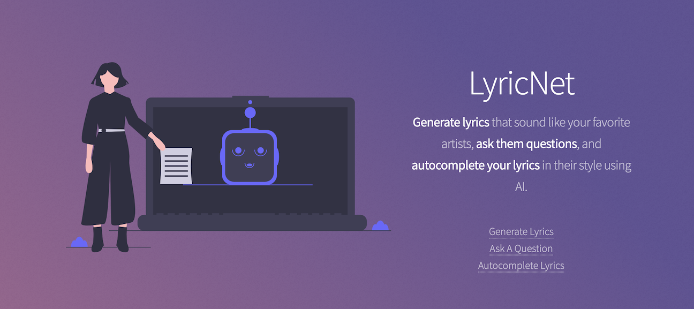

# LyricNet

## Website to generate lyrics like your favorite artists using deep learning

[Devpost](https://devpost.com/software/lyricnet)

# Inspiration

We wanted to use the power of state of the art natural language processing (NLP) to aid musicians in their creative ventures, specifially for writing song lyrics. In order to achieve this we decided to see what went on in the minds of the most successful music artists of our time, like Taylor Swift, Drake, and many others. We wanted to see what makes these artists so unique, and share our machine learning tools with the world. Of course, we couldn't pick at their brains and get them to write lyrics for us, so we decided to build an AI-powered web application to do that for us.

# What it does

- Auto-fills lyrics in the style of an artist given a few starting lyrics (artists include those that are pre-trained by us, and custom artists that can be trained on the spot using song lyrics pulled from the genius API)
- Answers questions in the style of a chosen artist given a question
- Generates a full set of lyrics based on the style of a specified artist with rhymes, given a number of lines and syllables per line to generate

# How we built it

## Technologies

- Back end: Flask
- Front end: React, bootstrap
- Machine Learning: Tensorflow Keras (LSTM, RNN, GRU, BERT)

We built the web application using React for the front-end and Flask for the back-end. We used Flask over Node.js since we were using Python for the machine learning part of the project, so having the same language compatibility made it easier for us to develop the project. To generate lyrics, we used a LSTM (Long Short-Term Memory) along with an RNN (Recurring Neural Network) with Markov Chains and a rythming library. To auto-complete lyrics, both an RNN (GRU) and markov chains were used, the RNN to memorize sequences of characters from a specific song, which allowed for prediction of the next most probable character in a sequence, as well as a markov chain model, which allowed for real words to be outputted 100% of the time, although no information is derived from previous words in the sentence. Since the sequences are specific to each artist, the lyrics are generated in a style of different groups and people. Finally, for the question-answering feature, we trained a BERT (Bidirectional Encoder Representations from Transformers) model to answer a question given by a user.

# Challenges we ran into

The biggest challenge for us was utilizing the Google Cloud Platform (GCP). It was a new experience for all of us since we've never deployed anything using the tools provided by GCP. Furthermore, coordinating with others virtually is something we collectively found to be difficult. Since our group members have different skill sets, it was difficult for some to coordinate tasks and understand concepts. However, through using certain tools such as Github (issue board, version tracking), we were able to efficiently assign and complete tasks which resulted in a working, successful project.

# Accomplishments that we're proud of

The biggest accomplishment for us was the successful completion of our project, and getting our platform running online. This milestone means that we have actually achieved our goal and gave people a new source of inspiration and a new tool for creating music and poetry, we did our contribution to the beauty of this world. On the technical side, the biggest achievement for our group was getting the React-based front-end to communicate with the Flask API, which recieved the model output and allowed the user to interact with the API in a friendly manner. It was satisfying to see the different parts of our system run smoothly and efficiently with minimal error. We are also proud to have come together on such short notice to create such fun and interesting project. It was amazing for us to see how quickly we were able to come up with ideas and use our different skill sets to develop an interesting, fun project in such a short period of time.

# What we learned

We certainly learned quite a bit while building the project, especially when it came to professionally deploying projects. Using Google Cloud's platform was quite a daunting task as nobody in our group had deployed a project to the platform before. We learned how to use buckets for the front-end, compute engine for the Flask back-end and AI Platform for our machine learning needs. Additionally, we learned how to configure and use a custom domain (using domain.com) which will certainly help us individually in the future.

# What's next for LyricNet

We plan to fine-tune the question-answering feature to provide more complex answers to the many questions that users may ask. We also want to fine-tune and add a lot to our other models to make our platform work even better!
